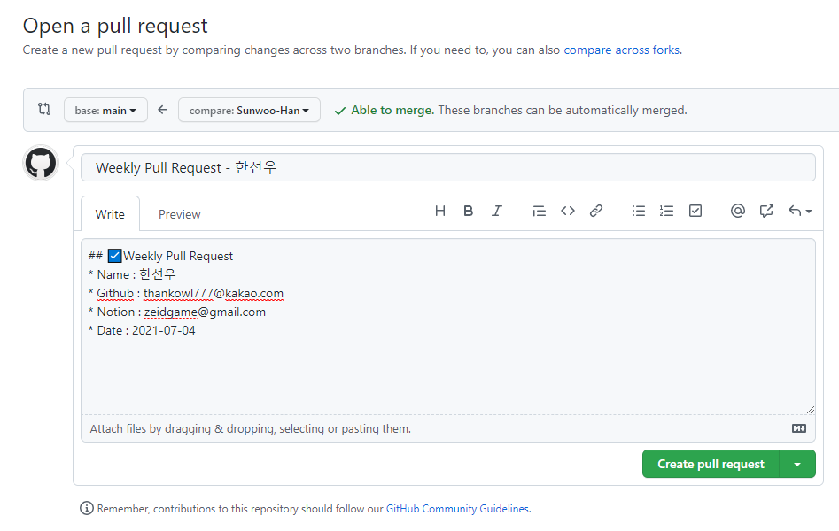

# Algorithm

* 브랜치명은 자신의 이름으로 한다 (ex. Sunwoo-Han)
* 자신의 브랜치에만 커밋한다
* 1문제당 1커밋을 원칙으로 한다
* 커밋 메시지는 간결하고 명확하게 작성한다

```
feat(<branch>): [<플랫폼>, <문제번호>] <문제이름>

<문제 링크>
``` 

# Example Commit Message
```
feat(sunwoo): [BOJ, 2557] Hello World

https://www.acmicpc.net/problem/2557
```


# Git remote branch 가져가는 법

* git repo clone 하기

```
git clone https://github.com/Yadon079/learning-algorithm
```

* git remote branch 확인

```
git branch -r
```

* 자신의 저장소(브랜치) 가져가기

```
git checkout -t origin/<branch>
```

# Example

```
git checkout -t origin/Sunwoo-Han
```


# PR 하는 법

* PR은 매주 일요일 오후 10시까지 요청
* 제목은 아래와 같은 양식으로 한다

```
Weekly Pull Request - [이름]
```

* 내용은 아래와 같은 양식으로 한다

```
## ☑️Weekly Pull Request
* Name : [이름]
* Github : [깃허브 이메일 주소]
* Date : [YYYY-MM-DD]
```

# Example


